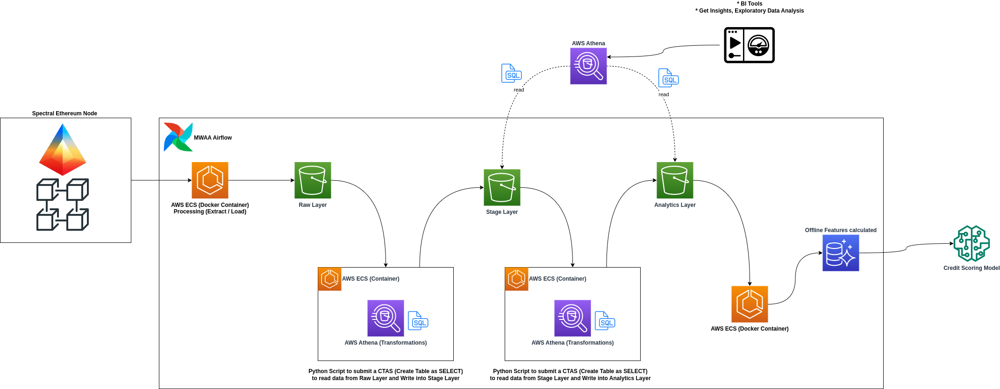
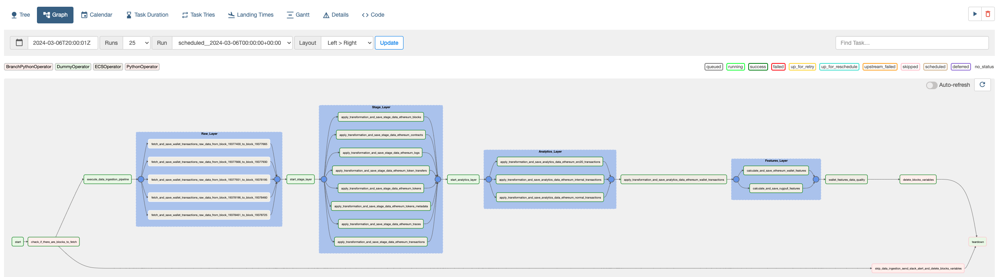

# Wallet and Risky Features Data Pipeline - Spectral Labs

This repository is designed to store code associated with the project aimed at fetching wallet transactions from an Ethereum Node, which we have deployed in-house. Currently, the process runs in batches. However, with this node, we will be able to transition to a streaming process in the future.

To implement this project, we have deployed an Ethereum node on AWS using the Erigon client and have developed a data pipeline utilizing the Ethereum-ETL library to retrieve wallet transactions directly from the node. This pipeline extracts data from the node and stores it in the raw layer of our data lakehouse. Subsequent transformations are applied, and the processed data is then stored in both the staging and analytical layers. The analytical layer hosts the final table, which is prepared and available for analysis to derive insights.

If you want to know more details about the ethereum-etl lib, you can check the github repository: https://github.com/blockchain-etl/ethereum-etl

## Features Data Dictionary

This table describes various features used to analyze the overall activity of a user's wallet.

| Feature Name | Data Type | Description |
|---|---|---|
| first_tx_timestamp | int | UNIX timestamp of the wallet's first transaction. |
| last_tx_timestamp | int | UNIX timestamp of the wallet's last transaction. |
| wallet_age | int | Time in seconds since `first_tx_timestamp`. |
| incoming_tx_count | int | Number of incoming transactions to the wallet. |
| outgoing_tx_count | int | Number of outgoing transactions from the wallet. |
| net_incoming_tx_count | int | `incoming_tx_count` - `outgoing_tx_count` |
| total_gas_paid_eth | float | Total gas paid in ETH by the wallet. |
| avg_gas_paid_per_tx_eth | float | Average gas fee paid in ETH per transaction. |
| risky_tx_count | int | Number of risky transactions. |
| risky_unique_contract_count | int | Number of unique risky smart contracts the wallet has interacted with. |
| risky_first_tx_timestamp | int | UNIX timestamp of the wallet's first risky transaction. |
| risky_last_tx_timestamp | int | UNIX timestamp of the wallet's last risky transaction. |
| risky_first_last_tx_timestamp_diff | int | `risky_first_tx_timestamp` - `risky_last_tx_timestamp` |
| risky_sum_outgoing_amount_eth | float | Sum of outgoing amounts in ETH for all risky transactions. |
| outgoing_tx_sum_eth | float | Total value in ETH of the wallet's outgoing transactions. |
| incoming_tx_sum_eth | float | Total value in ETH of the wallet's incoming transactions. |
| outgoing_tx_avg_eth | float | Average amount in ETH of the wallet's outgoing transactions. |
| incoming_tx_avg_eth | float | Average amount in ETH of the wallet's incoming transactions. |
| max_eth_ever | float | The wallet's maximum value in ETH ever, measured on the first block of each day. |
| min_eth_ever | float | The wallet's minimum value in ETH (after the first nonzero balance event), measured on the first block of each day. |
| total_balance_eth | float | The wallet's value in ETH, measured on the first block of the day. |


### Data Pipeline



### Requirements to run this project
* You need to install the AWS CLI and configure using your AWS secrets.
  * You can follow this documentation: https://docs.aws.amazon.com/cli/latest/userguide/getting-started-install.html
* You need to install the Terraform CLI in your local computer.
  * Follow this documentation to install:https://learn.hashicorp.com/tutorials/terraform/install-cli
* Docker and Docker-compose installed.

## Details about the Data Pipeline

### Raw Data Pipeline
This repository contains pipelines designed to retrieve data from the Ethereum Node and other sources such as Transpose, storing it in the Raw Layer of the Data Lakehouse. This layer is tasked with preserving the data exactly as it is received from these sources. We store the data in Parquet file format and partition it by year and month for optimal organization and access.

The script responsible to execute the raw data ingestion pipeline is available here:

[Raw Data Pipeline](src/pipelines/raw/raw_data_ingestion_pipeline.py)

## Stage Data Pipeline

Once the raw data is accessible, it will be necessary to perform several transformations to ensure the data is correctly structured in terms of schema, free of null values, devoid of duplicates, and subject to additional modifications. The purpose of the staging layer is to clean the data, ensuring it is prepared and available for our team to engage in exploration, data modeling, and other analytical endeavors.

In our scenario, we are conducting these transformations using Athena by adopting the Create Table As Select (CTAS) feature. This method is chosen because it allows us to use SQL for the transformations, which is incredibly advantageous for our processes. Consequently, we create tables in Athena and export the transformed data to S3 as Parquet files, utilizing an incremental ingestion method. Moreover, the data is partitioned by year and month, facilitating efficient data management and access.

[Stage Data Pipeline](src/pipelines/stage/stage_data_ingestion_pipeline.py)

[SQL Transformations](src/pipelines/stage/transformations)

## Analytics Data Pipeline

The Analytics Data Pipeline stands as the cornerstone of our infrastructure. This pipeline is dedicated to creating tables based on specifically designed data models for defined purposes, such as Wallet and Risky Features analysis. The initial step in this process involves identifying the types of transactions we are dealing with, which include internal, normal, and ERC20 transactions. Following this identification, we proceed to create a distinct table for each transaction type.

The segregation of transactions into specific types is crucial for data analysis and feature generation purposes. Once these transaction tables are established, we create an additional table that consolidates all types of transactions into a single repository. In this comprehensive table, we further classify the wallet_address based on its `role` in the transaction, distinguishing between `sender` and `receiver`. This classification is an essential part of the feature generation process, as it provides valuable insights into transaction dynamics.

[SQL Query - Normal Transactions](src/pipelines/analytics/transformations/ethereum_normal_transactions.sql)

[SQL Query - Internal Transactions](src/pipelines/analytics/transformations/ethereum_internal_transactions.sql)

[SQL Query - ERC20 Transactions](src/pipelines/analytics/transformations/ethereum_erc20_transactions.sql)

[SQL Query - Wallet Transactions](src/pipelines/analytics/transformations/ethereum_wallet_transactions.sql)

To exeucte those transsformations we are using this pipeline:
[Analytics  Pipeline - Transactions](src/pipelines/analytics/analytics_data_ingestion_pipeline.py)

### Features Generation

Finally, once we have prepared all the necessary tables for feature generation, we execute another SQL query designed to generate features for each wallet on the blockchain. A key aspect of our approach is the incremental manner in which we perform this task. To facilitate this, we utilize Athena in conjunction with Apache Iceberg (an Open Table Format), enabling us to perform UPSERT operations in Athena. This capability is crucial for our incremental feature generation process, as it allows us to aggregate values incrementally and efficiently. This strategy ensures that our data remains up-to-date and reflects the latest changes without needing to reprocess the entire dataset, thereby optimizing our resources and enhancing the accuracy of our analytics process.

Our objective with this pipeline is to process the features in a batch manner, ensuring they are ready for subsequent use, such as in Machine Learning models. This approach eliminates the need for any on-the-fly calculations at the time of inference; instead, we can directly utilize the pre-calculated features. While this methodology bears similarities to a feature store, it is not a feature store in the traditional sense. Think of it as a variant or a simplified version of a feature store. This strategy enables a more streamlined and efficient use of resources, allowing for quicker and more effective model training and inference by providing readily available, pre-processed features.

[Features Pipeline](src/pipelines/analytics/features/features_pipeline.py)

[SQL Features Generation - Wallet Features](src/pipelines/analytics/features/queries/ethereum_wallet_features.sql)
[SQL Features Generation - Risky Features](src/pipelines/analytics/features/queries/rugpull_features.sql)


## How to run each pipeline locally?

To run the project locally you have two options, you can run using a virtual env or using Docker.

### Using Virtual Env

Create the virtual env:
```
make create_local_env
```

Run the pipeline (Raw Layer):
```
python main.py \
    --start-block 16577023 \
    --end-block 16577058 \
    --data-lake-layer raw
```

Run the pipeline (Stage or analytics Layer):
```
# stage
python main.py \
    --table-name ethereum_blocks \
    --data-lake-layer stage

# analytics
python main.py \
    --table-name ethereum_normal_transactions \
    --data-lake-layer analytics

# analytics - wallet transactions
python main.py \
    --table-name ethereum_wallet_transactions \
    --data-lake-layer analytics

# analytics - wallet features
python main.py \
    --table-name ethereum_wallet_features \
    --data-lake-layer features
```

### Using Docker

To run the pipeline using docker, the first you need to do is build the docker image, to do that you can execute the follow command:
```
make build_image
```

After build the docker image, now you can execute the pipeline:
```
# Raw Layer
docker run \
    --network=host \
    -e APP_ENV=dev \
    -e SSH_TUNNEL=true \
    -e AWS_ACCESS_KEY_ID="$(aws --profile default configure get aws_access_key_id)" \
    -e AWS_SECRET_ACCESS_KEY="$(aws --profile default configure get aws_secret_access_key)" \
    data-lakehouse/wallet-and-risky-features-data-pipeline:latest \
    python main.py \
        --start-block 16577023 \
        --end-block 16577058 \
        --data-lake-layer raw

# Stage
docker run \
    --network=host \
    -e APP_ENV=dev \
    -e SSH_TUNNEL=true \
    -e AWS_ACCESS_KEY_ID="$(aws --profile default configure get aws_access_key_id)" \
    -e AWS_SECRET_ACCESS_KEY="$(aws --profile default configure get aws_secret_access_key)" \
    data-lakehouse/wallet-and-risky-features-data-pipeline:latest \
    python main.py \
        --table-name ethereum_blocks \
        --data-lake-layer stage

# Analytics
docker run \
    --network=host \
    -e APP_ENV=dev \
    -e SSH_TUNNEL=true \
    -e AWS_ACCESS_KEY_ID="$(aws --profile default configure get aws_access_key_id)" \
    -e AWS_SECRET_ACCESS_KEY="$(aws --profile default configure get aws_secret_access_key)" \
    data-lakehouse/wallet-and-risky-features-data-pipeline:latest \
    python main.py \
        --table-name ethereum_normal_transactions \
        --data-lake-layer analytics
```

## How to deploy this project in AWS development environment?

To deploy this project in dev environment is necessary to execute these steps:

* Create the ECS stack using Terraform on dev workspace
* Build the docker image
* Start Airflow locally

#### Create ECS Stack on dev Workspace and build the docker image

```
make create_ecs_stack ENVIRONMENT=dev
```

During the process of creating the ECS Stack, the docker image will be built, so in this case, you don't need to run the docker build process, just when you apply some code change and need to update the docker image.

To destroy the stack you can use this command:
**Info**: Before remove the entire stack you need to go to AWS console in ECR service and remove all images from the ECR repository related with this project.

```
make delete_ecs_stack ENVIRONMENT=dev
```

#### Run Airflow locally to execute the DAG

```
make setup_airflow_locally
```

Now you can access the Airflow ULR using these credentials:
* Airflow URL: http://localhost:8080
* user: **admin**
* password: **admin**

The DAG file is in the folder devops/airflow/dags and after running the Airflow, this dag will be loaded automatically, you will see the DAG in the Airflow UI.

Now the DAG it's available and you can run it.



## Checking the Data outputs

After run the data pipeline you can check the data output on the Data Lakehouse, you can see the files on bucket S3 (`data-lakehouse-{dev or prod}`) or you can execute some queries on Athena.

Tables:
```

# Raw Layer

ethereum_logs
ethereum_token_transfers
ethereum_transactions
ethereum_traces
ethereum_contracts
ethereum_tokens

# Stage

ethereum_logs
ethereum_token_transfers
ethereum_transactions
ethereum_traces
ethereum_contracts
ethereum_tokens

# Analytics

ethereum_erc20_transactions
ethereum_normal_transactions
ethereum_internal_transactions
ethereum_wallet_transactions
ethereum_wallet_features
rugpull_features # Risky Features
```

Example query in the production environment:
```
select * from db_raw_prod.ethereum_token_transfers # Raw Layer

select * from db_stage_prod.ethereum_token_transfers # Stage Layer

select * from db_analytics_prod.ethereum_erc20_transactions # Analytics Layer
```
